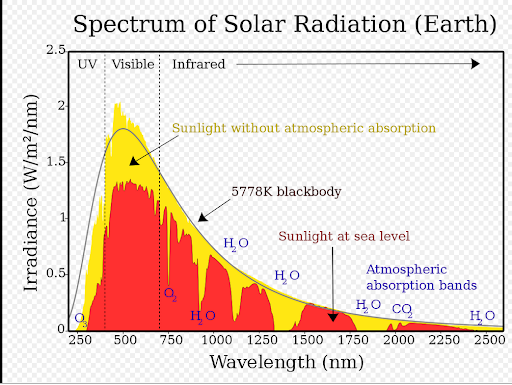

# NASA RESOURCES WEBSITE

* Shortwave radiation is radiant energy with wavelengths in the visible, near-ultraviolet, and near-infrared spectra
* The wavelength of light responsible for power generation in the solar panels:



This figure shows the solar radiation spectrum for direct light at both the top of the Earth's atmosphere (represented by yellow area) and at sea level (red area). The sun produces light with a distribution similar to what would be expected from a 5778 K (5505 °C) blackbody, which is approximately the sun's surface temperature. As light passes through the atmosphere, some are absorbed by gases with specific absorption bands. Additional light is redistributed by Raleigh scattering, which is responsible for the atmosphere's blue color. These curves are based on the American Society for Testing and Materials (ASTM) Terrestrial Reference Spectra, which are standards adopted by the photovoltaic industry to ensure consistent test conditions and are similar to the light that could be expected in North America. Regions for ultraviolet, visible, and infrared light are indicated.

Net radiation (Rn) is the sum of the net shortwave radiation (0.3–3.0 μm) (Rns) and the net longwave radiation (0.3–100 μm) (Rnl). The net shortwave is the difference between the incoming global solar radiation (G) and the reflected radiation (R)  from the ground, while the net longwave radiation is the difference between the downward (Ldn) and upward (Lup) radiation components. Therefore, the net radiation (Rn) is generally defined as the difference between incoming and outgoing radiation of both short and long wavelengths and it is expressed as follows :

```sh

Rn = Rns + Rnl = G(1 −ρg) + Ldn −Lup 

```

## Solar fluxes and related

1. All-Sky Surface Shortwave Downward Irradiance
   * Shortwave incidence in all-sky conditions
   * Units are energy/(area*days) - J/(m^2*days)
2. Clear Sky Surface Shortwave Downward Irradiance
   * Shortwave incidence in only clear sky conditions
   * A clear sky condition is defined generally as the absence of visible clouds across the entire skydome, and clear sky irradiance is the irradiance occurring during these conditions(less 10% of cloud cover)
   * Units are energy/(area*days) - J/(m^2*days)
3. All-Sky Insolation Clearness Index
   * Insolation is the solar radiation received by the Earth’s atmosphere or its surface
   * Dimensionless
   * Ratio of total solar radiation incident on a horizontal surface at the surface of the earth to the solar radiation incident at the top of the atmosphere
4. All-Sky Normalized Insolation Clearness Index
   * Dimensionless
5. All-Sky Surface Longwave Downward Irradiation
   * Downward longwave radiation is the heat emitted back to Earth from the atmosphere and can change depending on the composition of the air.

## GENERAL

Peak sun hours = KWh/m^2*day

```sh

Total Power Output = Total Area x Solar Irradiance x Conversion Efficiency

```

The majority of residential solar panels typically have an efficiency of 15-18%, although premium models can reach over 21%

## Example

[A Complete Guide to Solar Panel Output](https://www.linquip.com/blog/a-complete-guide-to-solar-panel-output/#Solar_Panel_Efficiency)

[Solar Radiation Shortwave Radiation](https://physics.stackexchange.com/questions/599848/solar-radiation-shortwave-radiation)

| Solar Panel System Size | Number of Solar Panels | Required Roof Space | Annual Electricity Output |
|---|---|---|---|
| 1kW | 4 | 8 sq. meters | 850 kWh |
| 2kW | 8 | 14 sq. meters | 1700 kWh |
| 3kW | 12 | 21 sq. meters | 2550 kWh |
| 4kW | 16 | 28 sq. meters | 3400 kWh |

* Estimation by Calculations
  * [How Many kWh Does A Solar Panel Produce Per Day? – Solar Website](https://diysolarshack.com/how-many-kwh-does-a-solar-panel-produce-per-day/#TABLE_kWh_produced_per_day_by_solar_panels_by_US_State_compared)
* 23% loss
  * [10 Solar PV System Losses – How To Calculate Solar Panel Efficiency – Solar Website](https://diysolarshack.com/10-solar-pv-system-losses-their-impact-on-solar-panel-output/)
  
Avg All Sky Surface Shortwave Downward Irradiance: 4.58 (
For 1kW system , annual power generated = 4.58 x 1kW x 365 x 0.77 = 1273 kW
